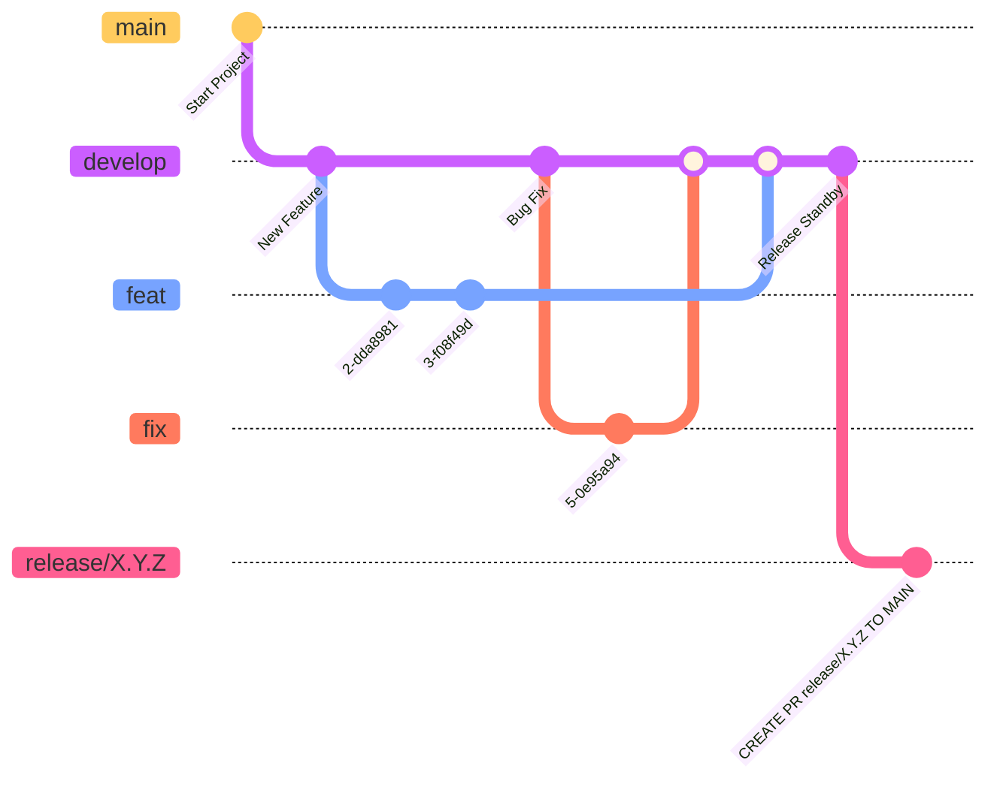

# ブランチ運用

ブランチ運用はいかに示す図の通り。

## mainブランチ

更新は`release/x.y.z`ブランチからのマージのみ。

_コミットもされないしプッシュもされない。_

## developブランチ

開発ブランチであり、デフォルトブランチ。

`hotfix`ブランチ以外はこのブランチからcheckoutする。

## featureブランチ

新機能開発など、機能を追加する際にcheckoutするブランチ。

`enhancement`ラベルを付与。

## fixブランチ

バグなどの修正を行う際にcheckoutするブランチ。

`bug`ラベルを付与。

## hotfixブランチ

リリースの際に発生したバグを修正するためなど、緊急修正用にmainからcheckoutするブランチ。

`bug`ラベルを付与。

## release/x.y.zブランチ

リリースの際にcheckoutするブランチ。

最新のdevelopから作成し、mainへマージする。

バージョニングは[セマンティックバージョニング](https://semver.org/lang/ja/)を使用する。
